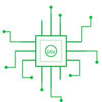

# ByteHarbor · 字节港湾

一个黑客风的个人主页导航站 —— 代码雨与终端日志流的深海，链接与灵感停靠的港湾。

> 纯前端 · 零依赖 · 无需构建，克隆即用。



## ✨ 特性

- **黑客风全屏背景**：纵深透视代码雨 + 左侧终端日志流，开箱即用的氛围
- **数据驱动链接卡片**：所有导航链接集中在 `js/links.js`，改一处全局生效
- **右键管理**：卡片/分组可右键添加、编辑、删除（数据存浏览器 localStorage）
- **多引擎搜索框**：内置百度 / 必应 / Google / GitHub / 哔哩哔哩，左侧可切换，记忆上次选择
- **终端彩蛋**：屏幕左右两侧右键弹出终端命令菜单；空白处左键点击随机蹦字
- **黑客风自定义鼠标**：绿色十字准星 + Matrix 字符尾迹
- **立体 404 页**：黑洞吞噬代码雨的 404 页面

## 🚀 快速开始

项目无框架、无构建工具、无 `package.json`，任何静态服务器或直接打开即可运行。

```bash
# 方式一：直接用 Python 起本地静态服务器
python -m http.server 8080

# 方式二：任意静态服务器（nginx / serve / 开发工具内置预览均可）
```

然后浏览器访问 `http://localhost:8080`。

## 🛠️ 自定义导航

所有内容都在 [`js/links.js`](js/links.js) 里配置：

```js
window.LINKS = {
  siteName: "ByteHarbor",          // 站点名
  subtitles: [...],                // 副标题（打字机轮换）
  footer: "...",                   // 页脚署名
  search: { engines: [...] },      // 搜索引擎（可增删）
  groups: [                        // 导航分组
    {
      name: "我的博客",            // 分组名
      icon: "📝",                 // 分组图标
      links: [                    // 卡片
        { title: "链接名", url: "https://...", desc: "描述", icon: "🔗" }
      ]
    }
  ]
};
```

- `url` 留空 → 渲染为「占位卡片」（虚线边框，点击蹦字提示）
- 也可以直接在页面上**右键卡片**进行可视化管理（修改会保存到当前浏览器的 localStorage）

## 🌐 部署

纯静态站点，可部署到任意静态托管平台：

- **Netlify / Vercel**：导入仓库即可，`404.html` 会自动作为自定义 404 页
- **GitHub Pages**：推送到仓库，开启 Pages，`404.html` 同样生效
- **任意 Nginx / 对象存储**：直接把项目文件放上去

## 📂 目录结构

```
homepage/
├── index.html          # 主页入口
├── 404.html            # 自定义 404 页（黑洞吞噬代码雨）
├── css/style.css       # 样式（暗色黑客风）
├── js/
│   ├── links.js        # ⭐ 站点数据（导航配置都在这）
│   ├── main.js         # 主页渲染逻辑
│   ├── rain.js         # 代码雨 + 终端日志流背景
│   ├── manage.js       # 右键管理 + 终端彩蛋
│   └── cursor.js       # 黑客风自定义鼠标
└── assets/circuit.svg  # 电路装饰图
```

## 📄 License

[MIT](LICENSE)
